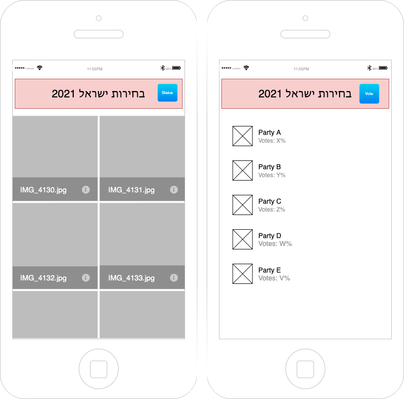

# Exercise No. 1 - Israel Elections 2021

> Lecturer: Ziv Levy

🔴 **Due Date: 23/03/2021** 🔴

## Overview & Purpose
In this exercise, you’ll get to install the React Native development environment (in case you haven’t done so already) and become more familiar and comfortable with your mobile development setup and coding.

The fun part: let’s see if we can forecast the elections results, taking place on March 23rd, 2021!

## Objectives
* Show a list of valid parties for vote.
* Let users vote for a specific party.
* Let the users see what’s the current status of the 5 top ranked parties.

## How to Get It Done!
1. Follow the submission guidelines in the following address: https://github.com/zivl/mobile-app-development-s21/tree/master/guides
2. There’s a server API which was built for this specific purpose, use the following API:
### API
Base URL: https://isr-elections.herokuapp.com/

Method: `GET` URL: `/api/parties` 
Description: Lists all the registered parties
Returns: `Array` in which every member of the array is of shape `{id: 'string'}`

Method: `POST` URL: `/api/parties/vote/:partyId` 
Description: Vote for a specific party by given `partyId` 
Params:
* `partyId`: *String* - the party id. 
`partyId` can be one of 
'likud' | 'yesh-atid' | 'kahol-lavan' | 'merez' | 'tikva-hadasha' | 'israel-beitenu' | 'shas' | 'yahadut-hatora' | 'meshutefet' | 'avoda' | 'zionut-datit' | 'gesher' | 'raam' | 'kalkalit'

Returns: `200 OK`

Method: `GET` URL: `/api/parties/poll-status` 
Description: Gets the current status of all *voted* parties. In case some party hasn't been voted, it will be omitted from the response 
Returns: `Object` which maps from `partyId` --> `Object` in the shape of `{ currentVotes: Number }`

## Screens
1. The first screen shows the user the parties he/she can vote. There will be a grid view of the parties in which each item in the grid consists of the party’s logo and the party’s official name as a caption of the logo. 
When the user presses to vote and the vote has been sent successfuly - a dialog message for the user will state that the vote has been accepted. 
See example image:

3. The second screen shows the top 5 ranked parties and the percentage of votes for each party. The list of parties should be ordered by the votes percentage in descending order

Note: Both screen should contain the same header component in which it has a title for the application and button to toggle between the two screens (Vote/Poll)

Use the following wireframe to layout your app properly

